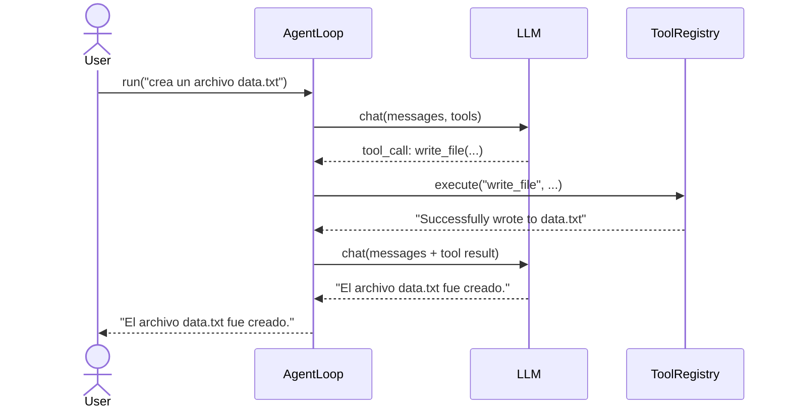

# Agent Loop

El **Agent Loop** es el núcleo del sistema. Implementa el patrón _ReAct_ (Reason + Act): el agente razona con el LLM, actúa ejecutando herramientas, observa el resultado y repite hasta obtener una respuesta final.

---

## Clase `AgentLoop`

```
app/agent.py → class AgentLoop
```

### Constructor

```python
AgentLoop(
    llm_provider: LLMProvider,   # cliente OpenAI o compatible
    workspace: Path,             # directorio de trabajo
    model: str | None = None,    # modelo a usar (default: proveedor decide)
    max_iterations: int = 40,    # límite de ciclos por ejecución
    max_tokens: int = 4000,      # tokens máximos por respuesta del LLM
)
```

El `ToolRegistry` se crea vacío en `__init__`. Las herramientas se registran en `agent.tools` antes de llamar a `run()`.

---

## Flujo de ejecución

```
run(prompt)
│
├─ messages = [{"role": "user", "content": prompt}]
│
└─ for _iteration in range(max_iterations):
       │
       ├─ response = _chat()          ← llamada al LLM con messages + tools
       │
       ├─ message = response.choices[0].message
       ├─ messages.append(message)
       │
       ├─ if not message.tool_calls:
       │      return message.content  ← RESPUESTA FINAL
       │
       └─ _handle_tool_calls(message.tool_calls)
              │
              ├─ parse tool name + arguments (JSON)
              ├─ tools.execute(name, **args)
              └─ messages.append({"role": "tool", "content": result, ...})

raise RuntimeError("max_iterations reached: 40")
```

### Estados posibles al final de un ciclo

| Estado | Condición | Siguiente paso |
|---|---|---|
| **Respuesta final** | `message.tool_calls` es vacío | Retorna `message.content` |
| **Tool call** | `message.tool_calls` contiene funciones | Ejecuta herramientas y continúa |
| **Sin choices** | `response.choices` está vacío | `RuntimeError` inmediato |
| **Límite alcanzado** | `_iteration == max_iterations - 1` | `RuntimeError` |

---

## `_chat()` — llamada al LLM

```python
def _chat(self):
    return self.llm_provider.chat.completions.create(
        model=self.model,
        messages=self.messages,
        tools=self.tools.to_openai_schema(),
        max_tokens=self.max_tokens,
    )
```

Convierte el `ToolRegistry` al formato OpenAI (`{"type": "function", "function": {...}}`) en cada llamada, de modo que el LLM siempre ve las herramientas actuales.

---

## `_handle_tool_calls()` — ejecución de herramientas

Para cada `tool_call` en la respuesta:

1. Verifica que `type == "function"` (ignora tipos desconocidos con log a stderr).
2. Deserializa `function.arguments` (JSON).
3. Llama a `tools.execute(name, **args)`.
4. Captura `KeyError`, `FileNotFoundError`, `ValueError`, `OSError` y los convierte en strings de error (el agente puede recuperarse sin abortar).
5. Agrega un mensaje `role: tool` al historial con el resultado.

---

## Protección contra bucles infinitos

La versión original usaba `while True:` ignorando `max_iterations`. El bug fue corregido: el loop ahora usa `for _iteration in range(self.max_iterations)` y lanza `RuntimeError` al agotar las iteraciones.

```python
for _iteration in range(self.max_iterations):
    ...

raise RuntimeError(f"max_iterations reached: {self.max_iterations}")
```

---

## Historial de mensajes

El historial se reinicia completamente en cada llamada a `run()`:

```python
self.messages = [{"role": "user", "content": prompt}]
```

Esto significa que **cada invocación es stateless** — el agente no recuerda conversaciones anteriores entre llamadas a `run()`. Si se necesita memoria entre sesiones, debe pasarse como parte del prompt.

---

## Diagrama de secuencia


